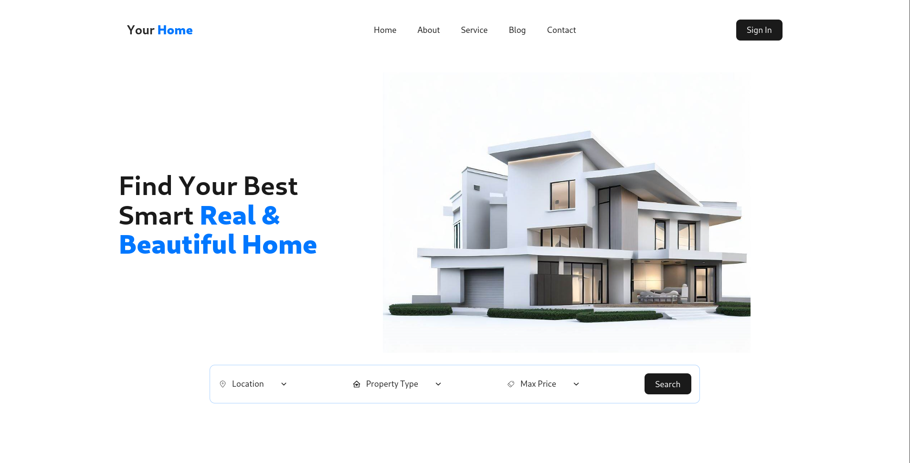

# Your Home

[Live Demo](https://yourhome-schoolproject.netlify.app/)

**Prepared for:** Web Design and Programming I (SEng3021)  
**Project Type:** Online property marketplace  
**Project Title:** YourHome  
**Prepared by:**

-   Yonatan Afewerk Teshome (917/13)
-   Abel Melaku Buzye (859/13)

## Project Overview: YourHome - An Online Property Marketplace

The traditional real estate market often restricts access to property listings, making it difficult for potential buyers and renters to find suitable options. We are planning this website solves this problem by providing an online platform that offers an extensive database of residential and commercial properties, empowering users with a wide range of choices.

### Technical Approach

**Front-End Development:**

-   Frameworks: React

**Styling and CSS Preprocessing:**  
_(No information for now)_

**Data Management:**  
_(No information for now)_

**Mobile Responsiveness:**

-   completely responsive in every device

## Conclusion

In conclusion, our website development for YourHome aims to deliver a cutting-edge and user-centric platform that revolutionizes the real estate industry.
